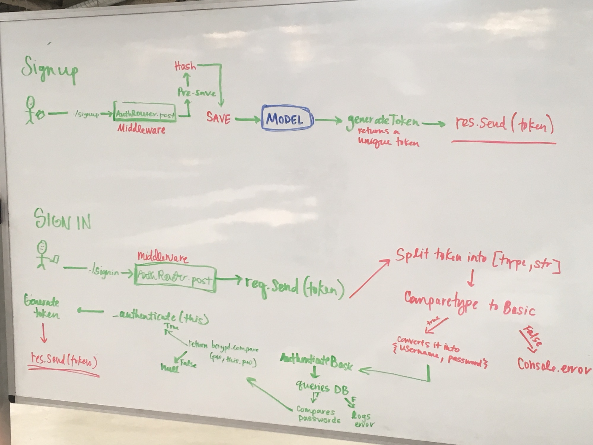

=================================================

## Authentication 

### Author: Caity Heath and Tanner Seramur 

### Links and Resources
* [Repository](https://github.com/CaityHeath/16-authentication)
* [Travis](https://www.travis-ci.com/CaityHeath/16-authentication)

### Modules
#### Auth 
* middleware.js
* router.js
* users-model.js

#### Middleware
* 404.js
* error.js

#### Routes
* book.js

#### Server
* app.js
* index.js

### Setup
#### Install node modules
* run the following code to install the necessary node modules:
`npm i `

#### `.env` requirements
* `PORT=3000`
* `MONGODB_URI=mongodb://localhost:27017/store`

#### Running the app
* `npm start` or `nodemon` will start the server
* to sign up run the following while your server is running: 
`echo '{"username":"_your_username_","password":"_your_password_"} | http POST :3000/signup`

* To sign in run the following command in terminal while your serer is running: 
`http post :3000/signin -a _your_username:_your_password`

 
 

* Endpoint: `/signup`
  * Returns a JSON object with abc in it.
* Endpoint: `/signin`
  * Returns a JSON object with xyz in it.
* Endpoint: `/books`
  
#### Tests
* To run tests locally run the following command `npm test`
* Tests can also be viewed in the travis link above
* The router tests check that users can sign in and sign up
* The middleware tests checks authentication credentials.

#### UML

